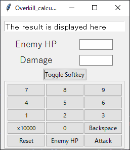

# Princess Connect carryover time calculator

This app for the clan battle in Princess Connect Re:Dive.

When you try to "Overkill", you can calculate the carry-over time.

## How to use

Required python =< 3.7
Run "app_eng.py"

Input Enemy HP and Damage and click Enter calculate that.

### Key bindings

- "Tab" or "(+ - * /)" change entry field.
- "Backspace" delete a character.
- "Period" or "Escape" Clear All.

### About soft keyboard

Can use soft keyboard on left click "Toggle Softkey" button.

- `Attack` Enter key.
- `Enemy HP` current input field.

### About calculation

Enemy hp is higher than damage, the damage is subtracted from hp, and enemy hp input will be updated to that value.

If two or three or more players attacking same time, you can easily calculate the damage by simply entering the damage, with the first player confirming, the second player confirming, and so on.

If damage exceeds enemy hp, the carryover time will be displayed.

Translated with www.DeepL.com/Translator (free version)

## Screen Shot

